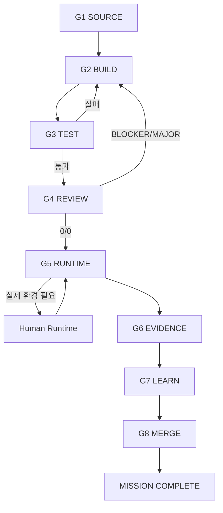

# Multi-Agent Mission Engineering Playbook

> Codyssey AI/SW Basic 미션을 여러 AI가 서로 일을 중복하거나 끝없이 검토하지 않으면서 빠르고 정확하게 완수하기 위한 공통 운영 규격이다.

## 0. 목적

이 문서는 다음 다섯 가지 엔지니어링을 하나의 미션 수행 체계로 결합한다.

1. **Prompt Engineering — 프롬프트 엔지니어링**: 각 AI에게 무엇을, 어떤 형식과 제약으로 요청할지 설계한다.
2. **Context Engineering — 콘텍스트 엔지니어링**: AI가 판단에 필요한 정확한 자료만 우선순위와 함께 제공한다.
3. **Harness Engineering — 하네스 엔지니어링**: 저장소, 브랜치, 테스트, 도구, 권한, 로그, 증빙을 AI가 안전하게 사용할 수 있는 실행 환경으로 묶는다.
4. **Loop Engineering — 루프 엔지니어링**: 분석 → 구현 → 검증 → 수정 → 종료의 반복 횟수와 종료 조건을 명시한다.
5. **Fusion Engineering — 융합 엔지니어링**: 여러 AI의 결과를 투표로 섞지 않고 Source of Truth, 테스트, 실제 Evidence를 기준으로 하나의 최종 결과로 통합한다.

`Fusion Engineering`은 이 프로젝트에서 사용하는 운영 용어다. 여러 모델의 답을 단순 평균하거나 다수결하는 것이 아니라, **역할 분리 + 독립 검증 + 증거 기반 통합**을 의미한다.

핵심 목표는 다음과 같다.

```text
MISSION SOURCE
     ↓
정확한 Context Pack
     ↓
ChatGPT Orchestration
     ↓
Primary Builder
     ↓
Automated Harness
     ↓
Independent Review 1회
     ↓
Evidence-based Fusion
     ↓
User Runtime (필요한 경우만)
     ↓
PASS → MERGE
```

---

## 1. 최상위 운영 원칙

모든 AI는 아래 원칙보다 높은 권한을 갖지 않는다.

```text
Mission 요구 > AI의 선호
Evidence > 주장
Test result > 추측
실제 Runtime > 예상 출력
완료 > 과도한 완벽주의
한 미션 완료 > 여러 미션 동시 미완성
```

Codyssey Basic의 기존 운영 기준을 그대로 유지한다.

- 한 미션씩 수행한다.
- `main` 직접 작업보다 `mission/<id>` → PR → `main`을 사용한다.
- `TODO / IMPLEMENTED / TESTED / PASS / NEEDS-RUNTIME / BLOCKED` 상태를 구분한다.
- `G1 SOURCE → G2 BUILD → G3 TEST → G4 REVIEW → G5 RUNTIME → G6 EVIDENCE → G7 LEARN → G8 MERGE` Gate를 사용한다.
- 실제 실행하지 않은 것을 PASS로 표시하지 않는다.
- BLOCKER=0, MAJOR=0이고 필수 요구·테스트·증빙이 충족되면 검증을 종료한다.
- 고도화 아이디어는 미션 완료를 지연시키지 않고 별도 Backlog로 이동한다.

---

## 2. Source of Truth

판단 충돌이 발생하면 다음 우선순위를 사용한다.

1. Mission PDF
2. Mission Markdown
3. 공식 Evaluation / 평가문항
4. 해당 미션과 직접 관련된 공식 운영 자료
5. 요구사항–증빙 매핑
6. README
7. 학습 문서
8. 코드
9. 테스트
10. 보고서
11. Evidence

외부 책, 블로그, AI 답변, 일반적인 Best Practice는 공식 요구사항을 변경하지 않는다.

---

## 3. 가장 중요한 해결책: 모든 AI를 매번 동시에 사용하지 않는다

여섯 개 AI를 모든 단계에서 동시에 실행하면 다음 문제가 생긴다.

- 중복 분석
- 서로 다른 설계 제안
- 불필요한 리팩터링
- 검토의 검토 반복
- 토큰·시간 증가
- 누가 최종 결정자인지 불명확

따라서 **Selective Multi-Agent Harness**를 사용한다.

### Core Lane — 기본 경로

```text
ChatGPT → Primary Builder → Test Harness → Independent Reviewer 1개 → ChatGPT Fusion → User Runtime
```

### Specialist Lane — 조건부 경로

Claude, Gemini, Grok 등은 특정 문제가 있을 때만 호출한다.

```text
긴 문서/설계 충돌      → Claude 후보
PDF·이미지·멀티모달     → Gemini 후보
반례·공격적 검토         → Grok 후보
IDE 내 작은 수정         → Copilot 후보
저장소 구현·테스트       → Codex 후보
전체 통합·최종 판정      → ChatGPT
```

제품 기능은 시점과 환경에 따라 바뀔 수 있으므로 **제품명이 아니라 역할 슬롯이 기준**이다. 사용 가능한 도구가 다르면 동일 역할을 다른 모델에 배정한다.

---

## 4. 역할 슬롯과 기본 배정

| 역할 슬롯 | 기본 AI | 핵심 책임 | 기본적으로 하지 않는 일 |
|---|---|---|---|
| Orchestrator / Integrator | ChatGPT | Source 분석, 계획, 역할 배정, 결과 통합, 최종 판정 | 다른 AI 결과를 무조건 채택 |
| Primary Builder | Codex | 저장소 탐색, 구현, 테스트, 작은 리팩터링 | 요구사항 재정의, 대규모 재설계 |
| IDE Pair / Quick Reviewer | Copilot | 국소 수정, IDE 보조, 짧은 독립 검토 | 전체 미션 지휘 |
| Context / Architecture Reviewer | Claude | 긴 문서 정합성, 설계 모순, 설명 품질 점검 | Source보다 일반론 우선 |
| Multimodal / Source Reviewer | Gemini | PDF·이미지·화면·다중 자료 대조가 필요할 때 보조 | 증거 없이 PASS 판정 |
| Adversarial Challenger | Grok | 반례, 빠진 실패 경로, 과신 탐지 | 무제한 보안/리팩터링 확장 |
| Runtime Authority | Human | 로컬·브라우저·클라우드·계정·실제 화면·실제 Evidence 확인 | 여러 AI의 기술적 논쟁 중재 |

### 기본 원칙

- **ChatGPT는 주 책임자이자 최종 Integrator다.**
- **Primary Builder는 한 번에 하나만 지정한다.**
- **Independent Reviewer도 기본 1개만 지정한다.**
- Claude/Gemini/Grok은 Trigger가 있을 때만 추가한다.
- 같은 파일을 여러 AI가 동시에 수정하지 않는다.

---

## 5. Prompt Engineering

좋은 프롬프트는 길이가 아니라 **명확한 계약**이 핵심이다.

모든 Agent Prompt는 가능하면 아래 8개 필드를 가진다.

```text
ROLE
GOAL
SOURCE OF TRUTH
SCOPE
INPUTS
CONSTRAINTS
OUTPUT CONTRACT
STOP CONDITION
```

### 공통 Prompt Template

```markdown
# ROLE
당신은 현재 미션의 <ROLE>이다.

# GOAL
<현재 Gate에서 달성해야 할 한 가지 목표>

# SOURCE OF TRUTH
1. Mission PDF
2. Mission Markdown
3. Evaluation
4. 저장소 요구사항 매핑

# SCOPE
- 허용: <파일/기능/검증 범위>
- 제외: <이번 단계에서 하지 않을 일>

# CONSTRAINTS
- 필수 요구사항을 임의 변경하지 않는다.
- 대규모 리팩터링 금지.
- 실제 실행하지 않은 것을 PASS로 표시하지 않는다.
- secret을 출력하거나 commit하지 않는다.

# OUTPUT CONTRACT
1. Verdict
2. Findings
3. Changed files 또는 Proposed changes
4. Tests
5. NEEDS-RUNTIME
6. Next action

# STOP CONDITION
현재 Gate의 종료 조건을 만족하면 멈춘다.
```

### Prompt 설계 금지 패턴

- “최고로 만들어 줘”만 단독 사용
- 역할·범위 없는 전체 저장소 수정 요청
- 서로 다른 AI에게 같은 구현을 동시에 시키기
- 요구사항과 Best Practice를 구분하지 않기
- “모든 문제를 찾아라”처럼 종료 조건 없는 감사

---

## 6. Context Engineering

AI 품질은 많은 자료보다 **정확한 Context Pack**에 더 크게 좌우된다.

### Mission Context Pack

각 미션 시작 시 다음 묶음을 만든다.

```text
MISSION CONTEXT PACK
├── 01-source
│   ├── Mission PDF / Markdown
│   └── Evaluation
├── 02-contract
│   ├── 필수 결과물
│   ├── 필수 기능
│   ├── 제약
│   ├── 테스트
│   └── Evidence
├── 03-repo-state
│   ├── tree
│   ├── 핵심 파일
│   ├── 현재 branch
│   └── git diff
├── 04-runtime
│   ├── OS / language / runtime
│   ├── dependency
│   └── 실제 실행 필요 항목
└── 05-current-gate
    ├── 목표
    ├── 완료된 항목
    ├── 미완료 항목
    └── 금지 범위
```

### Context 최소화 규칙

Agent에게 전체 대화 기록을 무조건 넘기지 않는다.

다음만 제공한다.

```text
현재 미션
+
현재 Gate
+
직접 관련 Source
+
현재 코드/차이
+
직접 관련 테스트
```

### Context Conflict Rule

문서와 코드가 충돌하면 다음 순서로 해결한다.

```text
공식 Source 확인
→ Evaluation 확인
→ 실제 Test 확인
→ Runtime/Evidence 확인
→ ChatGPT가 최종 판정
```

AI 모델의 자신감이나 다수결은 근거가 아니다.

---

## 7. Harness Engineering

Harness는 AI가 코드를 “쓸 수 있는가”보다 **안전하게 실행·검증·종료할 수 있는가**를 관리한다.

### 최소 Harness 구성

```text
Repository
├── AGENTS.md
├── Mission / Evaluation source
├── tests/
├── docs/
├── evidence/
└── scripts/ 또는 검증 명령
```

### Harness가 제공해야 하는 것

1. **Workspace Boundary** — 현재 미션 저장소 밖을 임의 수정하지 않음
2. **Git Boundary** — `mission/<id>` 한 작업 브랜치
3. **Tool Boundary** — 필요한 명령과 도구만 사용
4. **Test Harness** — 자동 검증 명령을 명확하게 제공
5. **Secret Boundary** — `.env`, key, token commit 금지
6. **Evidence Boundary** — 예상 출력과 실제 출력 구분
7. **Runtime Boundary** — AI가 실행할 수 없는 실제 환경은 `NEEDS-RUNTIME`
8. **Change Budget** — 현재 요구에 직접 필요한 최소 변경만 수행

### 권장 자동 검증 순서

```text
syntax
→ unit
→ integration
→ CLI / HTTP / API
→ lint / static checks
→ configuration validation
```

미션과 무관한 검사를 억지로 추가하지 않는다.

---

## 8. Loop Engineering

루프는 “더 좋아질 때까지”가 아니라 **명확한 종료 조건까지** 돈다.

### Standard Mission Loop



### Review Loop Budget

기본 예산:

```text
자체 검토        1회
독립 Agent 검토  1회
수정 후 재검증   필요한 항목만 1회
```

다음은 기본적으로 하지 않는다.

```text
Review
→ Review of Review
→ Another Agent Review
→ Architecture Rewrite
→ Review Again
```

### Escalation Trigger

추가 Agent를 호출할 수 있는 경우:

- Source 자체가 모호하거나 상충함
- 같은 테스트가 반복 실패하고 원인이 불명확함
- 보안/권한/데이터 손실 가능성이 있는 MAJOR가 남음
- PDF/화면/이미지 해석이 핵심임
- 설계 선택 두 개가 평가 결과에 직접 영향을 줌

Trigger가 없으면 Agent 수를 늘리지 않는다.

---

## 9. Fusion Engineering

여러 AI의 결과는 **다수결로 결정하지 않는다.**

### Fusion 우선순위

```text
Source of Truth
    ↓
Reproducible Test
    ↓
Actual Runtime
    ↓
Actual Evidence
    ↓
Agent Finding
    ↓
General Best Practice
```

### Finding 판정

ChatGPT는 각 Finding을 다음 중 하나로 분류한다.

- `ACCEPT` — Source/Test/Evidence에 의해 수정 필요가 명확함
- `PARTIAL` — 일부만 현재 미션에 필요함
- `REJECT` — 요구와 무관하거나 잘못된 제안
- `NEEDS-RUNTIME` — 실제 환경 확인 전 판정 불가
- `BACKLOG` — 좋은 개선이지만 현재 PASS와 무관함

### 동점 해결

두 Agent가 반대 의견을 내면:

```text
의견 A vs 의견 B
      ↓
공식 요구사항에 직접 매핑
      ↓
재현 가능한 Test 추가/실행
      ↓
그래도 불명확하면 Runtime/Evidence
      ↓
ChatGPT 판정
```

“모델이 더 유명하다” 또는 “두 모델이 같은 말을 했다”는 판정 근거가 아니다.

---

## 10. Agent Routing Table

| 상황 | 1차 담당 | 필요 시 보조 | 종료 기준 |
|---|---|---|---|
| Mission/Evaluation 분석 | ChatGPT | Claude 또는 Gemini | Requirement Matrix 완성 |
| 저장소 구현 | Codex | Copilot | 필수 구현 완료 |
| 작은 IDE 수정 | Copilot | Codex | 해당 diff 완료 |
| 긴 문서/설계 정합성 | Claude | ChatGPT | 모순 0 또는 분류 완료 |
| PDF/이미지/화면 대조 | Gemini | ChatGPT | Source 대조 완료 |
| 반례/공격적 검토 | Grok | ChatGPT | BLOCKER/MAJOR 보고 완료 |
| 독립 최종 검토 | Codex 또는 Copilot 중 1개 | 필요 시 Specialist 1개 | BLOCKER=0, MAJOR=0 |
| 실제 로컬/브라우저/클라우드 | Human | ChatGPT 안내 | 실제 결과 확보 |
| 최종 통합/상태 변경 | ChatGPT | 없음 | Gate/Status 정확히 반영 |

---

## 11. Agent별 최소 실행 프롬프트

### 11.1 ChatGPT — Orchestrator

```text
현재 미션의 Mission/Evaluation을 Source of Truth로 사용한다.
현재 Gate만 처리한다.
요구사항, 현재 구현, 테스트, Evidence를 대조하고 다음 한 단계만 결정한다.
다른 Agent의 결과는 증거와 대조하여 ACCEPT/PARTIAL/REJECT/NEEDS-RUNTIME/BACKLOG으로 분류한다.
PASS를 추정하지 않는다.
```

### 11.2 Codex — Primary Builder 또는 Independent Reviewer

Builder 모드:

```text
AGENTS.md와 Mission/Evaluation을 먼저 읽는다.
현재 요구에 필요한 최소 변경만 구현한다.
테스트를 실행하고 실제 결과를 보고한다.
대규모 리팩터링과 새 아키텍처 도입은 하지 않는다.
```

Reviewer 모드:

```text
코드를 먼저 수정하지 않는다.
BLOCKER, MAJOR, 필수 요구 누락, 실패 테스트, 허위 PASS, secret 노출만 우선 검사한다.
BLOCKER=0, MAJOR=0이면 종료한다.
```

### 11.3 GitHub Copilot — Quick Review / IDE Pair

```text
현재 선택된 파일과 직접 관련 테스트만 검토한다.
필수 요구 위반이나 명백한 버그를 우선한다.
스타일 선호나 대규모 리팩터링으로 범위를 넓히지 않는다.
```

### 11.4 Claude — Context / Architecture Reviewer

```text
제공된 Mission/Evaluation과 현재 설계·문서를 비교한다.
긴 문맥에서 요구사항 누락, 용어 불일치, 구조적 모순을 찾는다.
일반적인 이상적 아키텍처보다 현재 미션 PASS 기준을 우선한다.
```

### 11.5 Gemini — Multimodal / Source Reviewer

```text
제공된 PDF, 이미지, 화면, 문서와 현재 구현 설명을 대조한다.
눈으로 확인 가능한 요구사항과 Evidence 누락을 중심으로 보고한다.
실제 확인하지 않은 화면이나 실행 결과를 추정하지 않는다.
```

### 11.6 Grok — Adversarial Challenger

```text
현재 구현이 실패할 수 있는 명백한 반례를 찾는다.
평가 실패로 이어질 BLOCKER/MAJOR만 우선한다.
추가 기능, 무제한 보안 강화, 취향 기반 리팩터링은 제안하지 않는다.
```

---

## 12. 공통 Agent Output Contract

모든 Agent는 가능하면 아래 형식으로 결과를 반환한다.

```markdown
## Verdict
PASS-CANDIDATE | NEEDS-FIX | NEEDS-RUNTIME | BLOCKED

## BLOCKER
- 없음 또는 항목

## MAJOR
- 없음 또는 항목

## Tests
- 명령:
- 결과:

## Requirement gaps
- 없음 또는 항목

## NEEDS-RUNTIME
- 없음 또는 실제 환경 확인 항목

## Changed files
- 파일명과 변경 목적

## Next action
- 한 단계만 제안
```

Agent가 장문의 자유 형식 보고서를 쓰는 것보다 이 계약을 우선한다.

---

## 13. Mission Execution Protocol

### G1 — SOURCE

ChatGPT:

1. Mission/Evaluation 읽기
2. 필수/선택 분리
3. 요구사항 ID 생성
4. Runtime/Evidence 항목 분리
5. 현재 저장소와 대조

산출물:

```text
Requirement Matrix
+
Gap List
+
Minimal Plan
```

### G2 — BUILD

Primary Builder 1개만 사용한다.

기본 선택:

```text
Repository 작업 중심 → Codex
IDE 국소 작업 중심   → Copilot
```

ChatGPT는 결과를 통합한다.

### G3 — TEST

Harness에 정의된 자동 검증만 실행한다.

실패하면 실패한 범위만 Builder Loop로 돌린다.

### G4 — REVIEW

Independent Reviewer는 Builder와 다른 관점으로 검토한다.

기본:

```text
Codex가 Build → Copilot Review
Copilot이 Build → Codex Review
```

특수 Trigger가 있을 때만 Claude/Gemini/Grok 중 하나를 추가한다.

### G5 — RUNTIME

AI가 실제로 확인할 수 없는 것만 사용자에게 요청한다.

예:

- 로컬 OS 권한
- 브라우저 실제 렌더링
- 외부 Public URL
- 클라우드 콘솔
- 계정/인증
- 실제 네트워크

### G6 — EVIDENCE

실제 출력만 저장한다.

```text
예상 출력 ≠ Evidence
실제 실행 결과 = Evidence
```

### G7 — LEARN

완성된 코드와 실제 장애를 기준으로 학습 자료를 만든다.

```text
목표 → 개념 → 전체 그림 → 실행 → 출력 읽기 → 오류 → 복구 → 자기 설명
```

### G8 — MERGE

아래 조건이 모두 충족되면 PR을 `main`에 통합한다.

```text
필수 요구 충족
AND 평가 요구 충족
AND BLOCKER=0
AND MAJOR=0
AND 필수 테스트 통과
AND 필요한 Runtime 완료
AND 필요한 Evidence 완료
```

---

## 14. 상태 머신

```text
TODO
  ↓
IMPLEMENTED
  ↓
TESTED
  ↓
PASS
```

예외 상태:

```text
NEEDS-RUNTIME
BLOCKED
```

학습 상태는 별도로 관리한다.

```text
NOT-STUDIED
  ↓
PRACTICED
  ↓
EXPLAINABLE
  ↓
MASTERED
```

`PASS`와 `MASTERED`는 동일하지 않다.

---

## 15. Multi-Agent Safety Rules

1. 같은 브랜치에서 여러 Agent가 동시에 같은 파일을 수정하지 않는다.
2. secret, token, password, private key를 prompt/log/evidence/commit에 남기지 않는다.
3. Agent가 실제 수행하지 않은 테스트 결과를 생성하지 않는다.
4. 모델의 추측을 Evidence로 사용하지 않는다.
5. Source가 없는 새 필수 요구를 만들지 않는다.
6. `main` 병합은 완료 조건을 통과한 후 수행한다.
7. 자동화할 수 있는 검증을 사용자에게 떠넘기지 않는다.
8. 실제 환경에서만 확인 가능한 것은 AI가 성공했다고 주장하지 않는다.

---

## 16. 비용·속도 최적화 규칙

### 기본 모델 사용량

한 미션의 기본 AI 흐름은 다음 정도로 제한한다.

```text
ChatGPT        상시 Orchestration
Builder        1개
Reviewer       1개
Specialist     0개
```

Specialist는 Trigger가 있을 때 최대 1개부터 추가한다.

### 하지 않는 것

```text
6개 모델 전부에게 같은 질문
6개 모델 전부에게 같은 코드 구현
6개 결과 다수결
모든 MINOR 수정
끝없는 재검토
```

### 비용을 더 써야 하는 순간

- PASS 여부가 불명확한 MAJOR
- 데이터 손실/권한/보안과 직접 관련된 문제
- Term Project의 핵심 아키텍처 결정
- 실제 평가 실패 가능성이 높은 상충 요구

---

## 17. 권장 Repository 적용 구조

각 개별 Mission Repository에는 최소 다음을 권장한다.

```text
mission-repo/
├── AGENTS.md
├── README.md
├── docs/
│   ├── requirements.md
│   ├── testing.md
│   ├── runtime.md
│   ├── troubleshooting.md
│   └── learning.md
├── evidence/
├── tests/
└── src/ 또는 실제 구현
```

대표 `codyssey-basic` Repository는 Control Tower 역할을 하며, 개별 코드 구현을 복제하지 않는다.

---

## 18. 좋은 개선안: Agent 이름보다 Mission Contract를 중심으로 운영한다

장기적으로 가장 안정적인 구조는 다음이다.

```text
                 Mission Contract
                      │
        ┌─────────────┼─────────────┐
        │             │             │
    Context Pack    Harness      Gate State
        │             │             │
        └─────────────┼─────────────┘
                      │
                 Agent Router
                      │
      ┌───────────────┼────────────────┐
      │               │                │
   Builder         Reviewer        Specialist
      │               │                │
      └───────────────┼────────────────┘
                      │
                 Fusion Engine
                      │
             Test / Runtime / Evidence
                      │
                   MERGE
```

이 구조의 장점:

- ChatGPT, Codex, Copilot, Claude, Gemini, Grok 중 일부가 바뀌어도 운영 체계는 유지된다.
- 모델별 프롬프트를 매번 새로 만들 필요가 없다.
- 어떤 AI가 무엇을 했는지 추적 가능하다.
- 다중 Agent의 가장 큰 문제인 중복 작업과 무한 Review를 방지한다.
- 미션 PASS와 학습 MASTERED를 동시에 관리할 수 있다.

즉 **AI 중심 구조가 아니라 Mission Contract 중심 구조**로 만든다.

---

## 19. 권장 Mission Contract

각 미션을 시작할 때 다음 계약만 확정하면 모든 Agent가 같은 기준으로 움직일 수 있다.

```yaml
mission: B1-1
source_of_truth:
  - mission.pdf
  - mission.md
  - evaluation.md
current_gate: G1_SOURCE
status: TODO
learning: NOT-STUDIED
builder: codex
reviewer: copilot
specialist: none
runtime_required: true
stop_rule:
  blocker: 0
  major: 0
  tests: pass
  evidence: complete
```

이 YAML은 예시다. 실제 미션 Source가 요구하지 않는 필드를 필수 제출물로 오해하지 않는다.

---

## 20. B1-1 적용 예시

```text
ChatGPT
  ↓ Mission PDF / Evaluation 분석
G1 SOURCE
  ↓
Codex
  ↓ 최소 구현
G2 BUILD
  ↓
Test Harness
  ↓ monitor.sh / configuration checks
G3 TEST
  ↓
Copilot 또는 Codex Independent Review
  ↓ BLOCKER/MAJOR만
G4 REVIEW
  ↓
Human
  ↓ 실제 Ubuntu / SSH / UFW / cron 확인
G5 RUNTIME
  ↓
Actual logs / screenshots / command outputs
G6 EVIDENCE
  ↓
ChatGPT
  ↓ 입문자 학습 자료
G7 LEARN
  ↓
PR → main
G8 MERGE
```

필요한 경우에만:

```text
긴 요구사항 충돌 → Claude
PDF/스크린샷 대조 → Gemini
실패 반례 탐색 → Grok
```

---

## 21. 최종 STOP RULE

다음이 충족되면 현재 미션에 대한 Agent Loop를 종료한다.

```text
Original Required Requirements = SATISFIED
Evaluation Requirements         = SATISFIED
BLOCKER                          = 0
MAJOR                            = 0
Required Tests                   = PASS
Required Runtime                 = COMPLETE 또는 NOT-REQUIRED
Required Evidence                = COMPLETE
```

그 이후 발견되는 다음 항목은 기본 미션을 지연시키지 않는다.

- MINOR
- STYLE
- 더 우아한 Architecture
- 추가 Framework
- 과도한 CI
- 일반적인 Best Practice 고도화
- 새로운 기능

필요하면 `docs/10-professional-growth` 또는 `docs/11-advanced`로 이동한다.

---

## 22. 한 문장 운영 규칙

> **ChatGPT가 Mission Contract를 지휘하고, 하나의 Builder가 구현하며, 하나의 Reviewer가 독립 검증하고, Specialist는 필요할 때만 투입하며, 최종 판단은 Source + Test + Runtime + Evidence를 기준으로 통합한다.**
