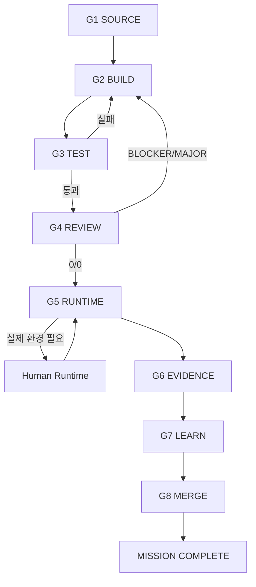

# Multi-Agent Mission Engineering Playbook

> Codyssey AI/SW Basic 미션을 여러 AI가 중복 작업이나 무한 검토 없이 빠르고 정확하게 완수하기 위한 공통 운영 규격이다.

## 0. 목적

이 문서는 다음 다섯 가지 엔지니어링을 하나의 Mission 수행 체계로 결합한다.

1. **Prompt Engineering** — 역할, 목표, 범위, 출력 계약, 종료 조건을 명확히 한다.
2. **Context Engineering** — 현재 Mission/Gate에 직접 필요한 Source와 Repo 상태만 제공한다.
3. **Harness Engineering** — Branch, Test, Runtime, Secret, Evidence 경계를 안전하게 유지한다.
4. **Loop Engineering** — 분석 → 구현 → 검증 → 수정 → 종료의 반복 횟수와 종료 조건을 통제한다.
5. **Fusion Engineering** — 여러 AI의 결과를 다수결이 아니라 Source, Test, Runtime, Evidence로 통합한다.

핵심 흐름은 다음과 같다.

```text
MISSION SOURCE
     ↓
Context Pack
     ↓
ChatGPT Orchestration
     ↓
Primary Builder 1개
     ↓
Automated Harness
     ↓
Independent Reviewer 1개
     ↓
Evidence-based Fusion
     ↓
User Runtime (필요한 경우)
     ↓
PASS → MERGE
```

---

## 1. 최상위 운영 원칙

```text
Mission 요구 > AI의 선호
Evidence > 주장
Test Result > 추측
Actual Runtime > 예상 출력
완료 > 과도한 완벽주의
한 Mission 완료 > 여러 Mission 동시 미완성
```

- 한 Mission씩 수행한다.
- `main` 직접 작업보다 `mission/<id>` → PR → `main`을 사용한다.
- Mission 상태는 `TODO / IMPLEMENTED / TESTED / PASS / NEEDS-RUNTIME / BLOCKED`를 사용한다.
- Mission Gate는 `G1 SOURCE → G2 BUILD → G3 TEST → G4 REVIEW → G5 RUNTIME → G6 EVIDENCE → G7 LEARN → G8 MERGE`를 사용한다.
- 실제 실행하지 않은 것을 PASS로 표시하지 않는다.
- BLOCKER=0, MAJOR=0이고 필수 요구·테스트·증빙이 충족되면 검증을 종료한다.
- 현재 Mission PASS와 무관한 개선은 Growth OS의 Activity/Project Backlog로 이동한다.

---

## 2. Source of Truth

판단 충돌 시 우선순위는 다음과 같다.

1. Mission PDF
2. Mission Markdown
3. 공식 Evaluation / 평가문항
4. 해당 Mission과 직접 관련된 공식 운영 자료
5. 요구사항–Evidence 매핑
6. README
7. 학습 문서
8. 코드
9. 테스트
10. 보고서
11. Evidence

외부 책, 블로그, AI 답변, 일반적인 Best Practice는 공식 요구사항을 변경하지 않는다.

---

## 3. Selective Multi-Agent Harness

모든 AI를 매번 동시에 사용하지 않는다.

### Core Lane

```text
ChatGPT
→ Primary Builder
→ Test Harness
→ Independent Reviewer 1개
→ ChatGPT Fusion
→ User Runtime
```

### Specialist Lane

특수 문제가 있을 때만 추가한다.

```text
긴 문서/설계 충돌      → Context/Architecture Reviewer
PDF·이미지·화면 대조   → Multimodal Reviewer
반례·실패 경로 탐색     → Adversarial Reviewer
IDE 국소 수정           → IDE Pair
저장소 구현·테스트      → Repository Builder
전체 통합·최종 판정     → ChatGPT
```

제품명은 바뀔 수 있으므로 **역할 슬롯이 기준**이다.

---

## 4. 역할 슬롯

| 역할 | 기본 책임 | 하지 않는 일 |
|---|---|---|
| Orchestrator / Integrator | Source 분석, 계획, 역할 배정, 결과 통합, 최종 판정 | Agent 결과 무조건 채택 |
| Primary Builder | 저장소 구현, 테스트, 필요한 최소 리팩터링 | 요구 재정의, 대규모 재설계 |
| Independent Reviewer | BLOCKER/MAJOR, 필수 누락, 실패 테스트 검토 | 취향 기반 무한 리팩터링 |
| Specialist Reviewer | 문서·멀티모달·반례 등 특정 문제 검토 | 범위 없는 전체 감사 |
| Runtime Authority | 로컬·브라우저·클라우드·계정·실제 Evidence 확인 | AI 논쟁을 다수결로 중재 |

기본 규칙:

- Primary Builder는 한 번에 하나만 지정한다.
- Independent Reviewer도 기본 하나만 지정한다.
- Specialist는 Trigger가 있을 때만 추가한다.
- 같은 파일을 여러 Agent가 동시에 수정하지 않는다.

---

## 5. Agent Prompt Contract

모든 Agent Prompt는 가능하면 다음 필드를 가진다.

```text
ROLE
GOAL
SOURCE OF TRUTH
SCOPE
INPUTS
CONSTRAINTS
OUTPUT CONTRACT
STOP CONDITION
```

권장 출력 형식:

```markdown
## Verdict
PASS-CANDIDATE | NEEDS-FIX | NEEDS-RUNTIME | BLOCKED

## BLOCKER
- 없음 또는 항목

## MAJOR
- 없음 또는 항목

## Tests
- 명령:
- 결과:

## Requirement gaps
- 없음 또는 항목

## NEEDS-RUNTIME
- 없음 또는 실제 환경 확인 항목

## Changed files
- 파일명과 목적

## Next action
- 한 단계만 제안
```

종료 조건이 없는 “최고로 만들어 줘”, “모든 문제를 찾아라” 같은 요청은 사용하지 않는다.

---

## 6. Mission Context Pack

```text
MISSION CONTEXT PACK
├── 01-source
│   ├── Mission PDF / Markdown
│   └── Evaluation
├── 02-contract
│   ├── 필수 결과물
│   ├── 필수 기능
│   ├── 제약
│   ├── Test
│   └── Evidence
├── 03-repo-state
│   ├── tree
│   ├── 핵심 파일
│   ├── branch
│   └── git diff
├── 04-runtime
│   ├── OS / language / runtime
│   ├── dependency
│   └── 실제 실행 필요 항목
└── 05-current-gate
    ├── 목표
    ├── 완료
    ├── 미완료
    └── 금지 범위
```

Agent에게 전체 대화를 무조건 넘기지 않고 현재 Mission/Gate에 직접 필요한 Context만 제공한다.

---

## 7. Harness Boundary

1. **Workspace Boundary** — 현재 Mission 저장소 밖을 임의 수정하지 않는다.
2. **Git Boundary** — 한 작업 Branch를 사용한다.
3. **Tool Boundary** — 필요한 명령과 도구만 사용한다.
4. **Test Boundary** — 자동 검증 명령을 명시한다.
5. **Secret Boundary** — `.env`, key, token을 commit하지 않는다.
6. **Evidence Boundary** — 예상 출력과 실제 출력을 구분한다.
7. **Runtime Boundary** — 실제 환경 확인이 필요하면 `NEEDS-RUNTIME`으로 둔다.
8. **Change Budget** — 현재 요구에 필요한 최소 변경만 수행한다.

권장 자동 검증 순서:

```text
syntax
→ unit
→ integration
→ CLI / HTTP / API
→ lint / static check
→ configuration validation
```

Mission과 무관한 검사를 억지로 추가하지 않는다.

---

## 8. Standard Mission Loop



기본 Review 예산:

```text
자체 검토        1회
독립 Agent 검토  1회
수정 후 재검증   필요한 항목만
```

추가 Reviewer는 Source 충돌, 반복 실패, 보안/권한/데이터 손실 위험, 멀티모달 검증, 평가에 직접 영향을 주는 설계 충돌이 있을 때만 사용한다.

---

## 9. Fusion Rule

여러 AI의 결과는 다수결로 결정하지 않는다.

```text
Source of Truth
    ↓
Reproducible Test
    ↓
Actual Runtime
    ↓
Actual Evidence
    ↓
Agent Finding
    ↓
General Best Practice
```

각 Finding은 다음 중 하나로 분류한다.

- `ACCEPT`
- `PARTIAL`
- `REJECT`
- `NEEDS-RUNTIME`
- `BACKLOG`

Agent 의견이 충돌하면 Source에 매핑하고 재현 가능한 Test를 추가한다. 그래도 불명확하면 Runtime/Evidence로 판정한다.

---

## 10. Mission Execution Protocol

### G1 — SOURCE
Requirement Matrix + Gap List + Minimal Plan을 만든다.

### G2 — BUILD
Primary Builder 하나만 사용하여 필수 구현을 완료한다.

### G3 — TEST
Harness에 정의된 자동 검증을 실행하고 실패 범위만 수정한다.

### G4 — REVIEW
Independent Reviewer가 BLOCKER/MAJOR와 필수 요구 누락을 중심으로 검토한다.

### G5 — RUNTIME
AI가 확인할 수 없는 실제 OS·브라우저·클라우드·계정·네트워크만 사용자 Runtime으로 확인한다.

### G6 — EVIDENCE
예상 출력이 아니라 실제 실행 결과를 저장한다.

### G7 — LEARN
완성 코드와 실제 장애를 기준으로 `목표 → 개념 → 전체 그림 → 실행 → 출력 읽기 → 오류 → 복구 → 자기 설명` 순으로 학습한다.

### G8 — MERGE
다음 조건을 모두 충족하면 PR을 `main`에 통합한다.

```text
필수 요구 충족
AND 평가 요구 충족
AND BLOCKER=0
AND MAJOR=0
AND 필수 Test PASS
AND 필요한 Runtime 완료
AND 필요한 Evidence 완료
```

---

## 11. Mission 상태와 학습 상태

Mission 상태:

```text
TODO → IMPLEMENTED → TESTED → PASS
```

예외:

```text
NEEDS-RUNTIME
BLOCKED
```

학습 상태:

```text
NOT-STUDIED → PRACTICED → EXPLAINABLE → MASTERED
```

`PASS`와 `MASTERED`는 동일하지 않다.

---

## 12. Growth OS V3 Routing

Mission 완료 이후 발견되는 개선을 Old Path에 직접 보내지 않는다. **Domain + Growth Stage + Status + Priority**로 등록한다.

```text
현재 Mission PASS와 직접 관련
→ 현재 Mission에서 처리

학습·스터디·세미나·탐색
→ docs/03-learning 또는 docs/04-community
→ Growth Stage: CORE / EXPLORE

재사용 가능한 장기 결과물
→ docs/05-projects + config/projects.yaml

공모전·해커톤·외부 프로그램
→ docs/06-opportunities + config/opportunities.yaml

연구 질문·실험·논문
→ docs/07-research

오픈소스 기여
→ docs/08-open-source

직무·포트폴리오·취업 준비
→ docs/09-career

사용자 검증·MVP·PoC·사업화
→ docs/10-venture

Evidence / Case Study
→ docs/11-portfolio

조직·연구·제품·사회적 영향
→ docs/12-impact
```

심화 기술 자체는 별도 `advanced/` 폴더를 만들기보다 관련 Domain/Project에 두고 `growth_stage: ADVANCED | PRO | EXPERT` 메타데이터로 관리한다.

### Growth Stage

```text
CORE → EXPLORE → ADVANCED → PRO → EXPERT
```

### Activity Status

```text
PLANNED → READY → ACTIVE → DONE
                  ↘ BLOCKED
DONE / 중단 결과 → ARCHIVED
```

### Priority

```text
REQUIRED / RECOMMENDED / OPTIONAL
```

---

## 13. Multi-Agent Safety Rules

1. 같은 Branch에서 여러 Agent가 동시에 같은 파일을 수정하지 않는다.
2. Secret, token, password, private key를 Prompt/Log/Evidence/Commit에 남기지 않는다.
3. 실제 수행하지 않은 Test 결과를 생성하지 않는다.
4. 모델 추측을 Evidence로 사용하지 않는다.
5. Source가 없는 새 필수 요구를 만들지 않는다.
6. `main` 병합은 완료 조건을 통과한 후 수행한다.
7. 자동화 가능한 검증을 사용자에게 떠넘기지 않는다.
8. 실제 환경에서만 확인 가능한 것은 AI가 성공했다고 주장하지 않는다.

---

## 14. 비용·속도 최적화

한 Mission의 기본 AI 흐름은 다음 정도로 제한한다.

```text
ChatGPT / Orchestrator   상시
Builder                  1개
Reviewer                 1개
Specialist               0개 또는 필요 시 1개
```

하지 않는 것:

```text
모든 모델에게 같은 질문
모든 모델에게 같은 구현
결과 다수결
모든 MINOR 수정
끝없는 재검토
```

---

## 15. 권장 Mission Repository 구조

```text
mission-repo/
├── AGENTS.md
├── README.md
├── docs/
│   ├── requirements.md
│   ├── testing.md
│   ├── runtime.md
│   ├── troubleshooting.md
│   └── learning.md
├── evidence/
├── tests/
└── src/ 또는 실제 구현
```

대표 `codyssey-basic` Repository는 **Control Tower / Growth OS** 역할을 하며 개별 Mission 코드 구현을 복제하지 않는다.

---

## 16. 최종 STOP RULE

```text
Original Required Requirements = SATISFIED
Evaluation Requirements         = SATISFIED
BLOCKER                          = 0
MAJOR                            = 0
Required Tests                   = PASS
Required Runtime                 = COMPLETE 또는 NOT-REQUIRED
Required Evidence                = COMPLETE
```

그 이후의 MINOR, STYLE, 추가 Framework, 일반 Best Practice, Architecture 고도화, 추가 기능은 현재 Mission을 지연시키지 않고 **Growth OS V3 Registry의 적절한 Domain/Stage/Status/Priority로 Routing**한다.

---

## 17. 한 문장 운영 규칙

> **ChatGPT가 Mission Contract를 지휘하고, 하나의 Builder가 구현하며, 하나의 Reviewer가 독립 검증하고, Specialist는 필요할 때만 투입하며, 최종 판단은 Source + Test + Runtime + Evidence를 기준으로 통합하고, Mission 이후의 개선은 Growth OS V3 Registry로 Routing한다.**
