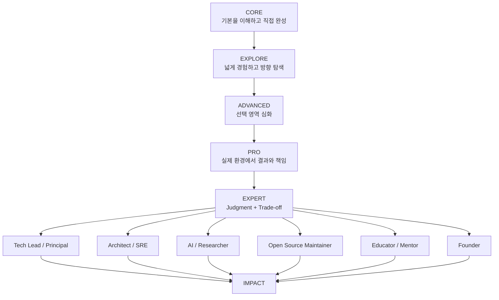
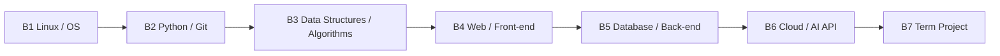

# Growth Map

## 전체 성장 흐름

## 단계별 핵심 질문

| Stage | 핵심 질문 | 핵심 결과 |
|---|---|---|
| CORE | 무엇이며 내가 직접 할 수 있는가? | Mission PASS + 이해 + Evidence |
| EXPLORE | 무엇이 가능하고 무엇을 더 깊게 볼 것인가? | 후보 경험 + 다음 선택 |
| ADVANCED | 어떻게 더 잘 만들고 왜 이 방법을 선택하는가? | 심화 구현 + ADR + Experiment |
| PRO | 실제 환경에서 결과를 책임질 수 있는가? | Real User / Production / External Evidence |
| EXPERT | 무엇을 선택해야 하며 왜 그런가? | Judgment + Trade-off + 고난도 해결 |

## 12개 역량 축

성장 단계와 별도로 아래 역량을 추적한다.

1. Learn
2. Build
3. Test
4. Debug
5. Collaborate
6. Design
7. Operate
8. Compete
9. Research
10. Communicate
11. Career
12. Venture

## Codyssey 기본 줄기

이 기본 줄기는 CORE의 중심이다. 각 Mission에서 EXPLORE 출구를 열고, 선택한 경험만 ADVANCED로 가져간다.

## Mission Lifecycle

`COMPLETE → UNDERSTAND → BREAK → DEBUG → COLLABORATE → EXPLORE → ADVANCE → PRO`

- COMPLETE: 빠르게 공식 요구사항 완성
- UNDERSTAND: 용어/개념/흐름 설명
- BREAK: 의도적으로 오류 발생
- DEBUG: 증거 기반 복구
- COLLABORATE: Issue/PR/Review
- EXPLORE: 인접 기술/활동 탐색
- ADVANCE: 선택 영역 심화
- PRO: 실제 환경 적용

## 현재 운영 원칙

- CORE: ACTIVE
- EXPLORE: READY
- ADVANCED: PLANNED
- PRO: PLANNED
- EXPERT: PLANNED

실제 수치는 Dashboard와 Config의 Evidence를 통해 갱신한다. 이 문서는 방향과 관계를 정의하며 진행률 수동 원장은 아니다.
