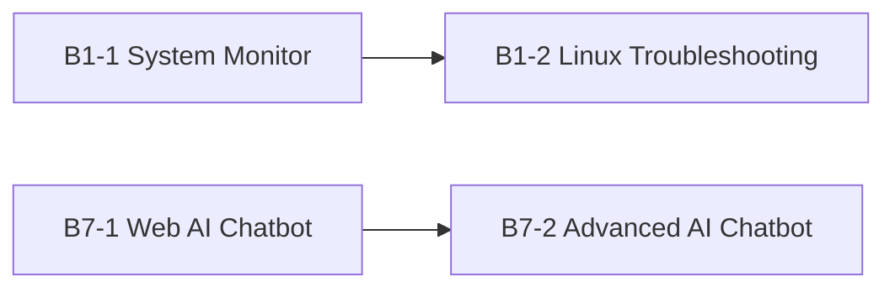
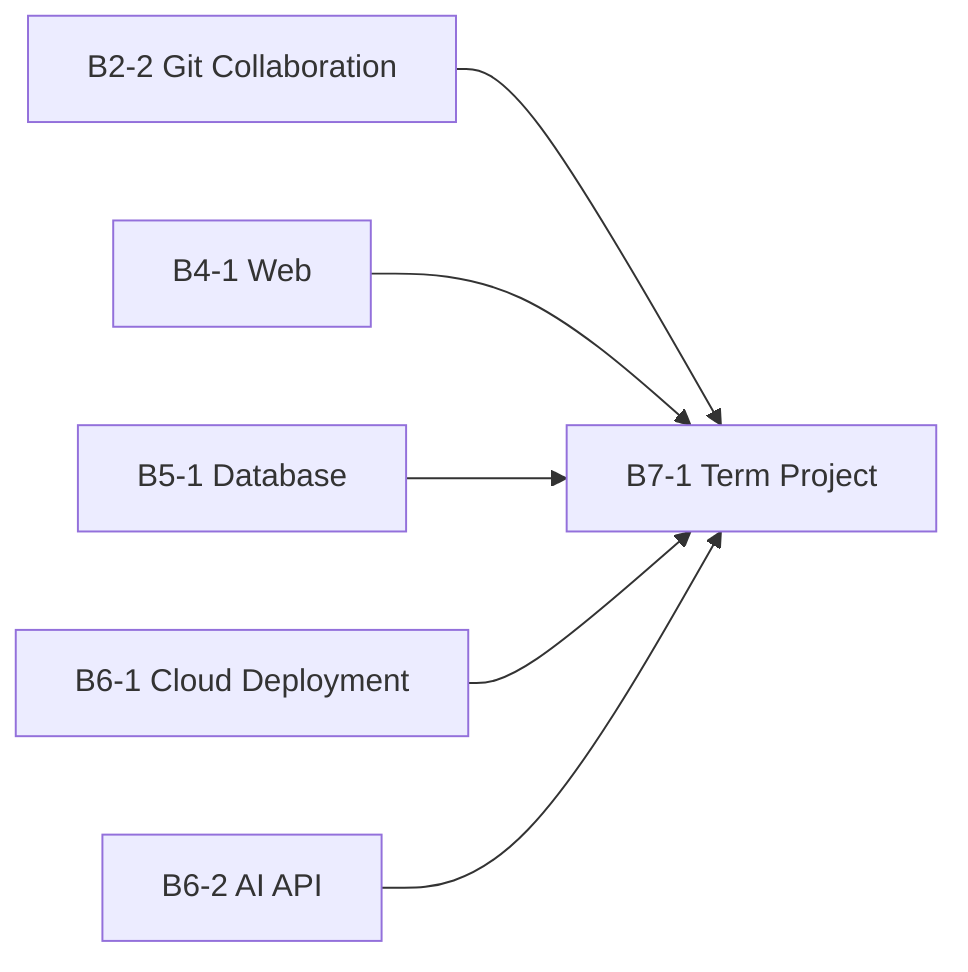
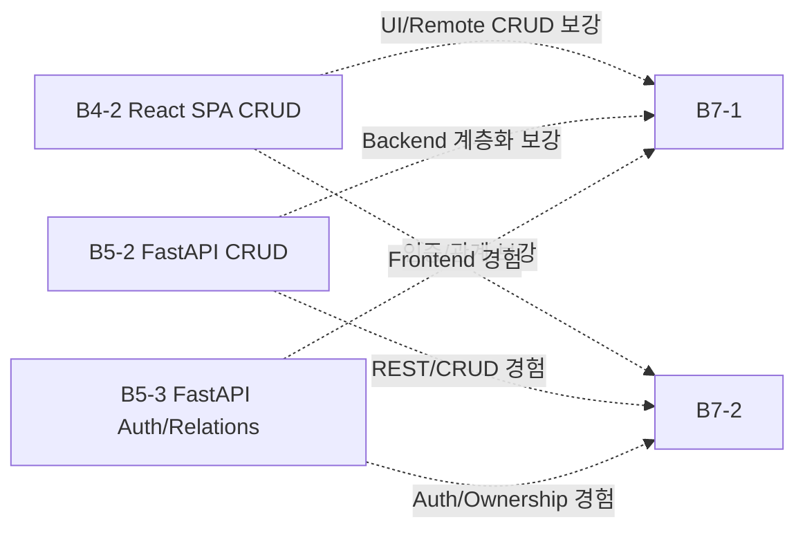

# R01 — Mission Dependency Map

동결일: 2026-08-17

## 목적

15개 미션의 **Hard Dependency**, **권장 학습 전이**, **선택적 보강 경로**를 분리해 Phase C에서 실행 순서를 임의로 왜곡하지 않도록 합니다.

## 1. Hard Dependency



- **B1-1 → B1-2**: B1-2는 B1-1의 Linux 관제/프로세스/포트/로그 사고방식을 재사용하고, Control Tower Runtime 순서도 B1-1 CLEAR 후 B1-2 시작으로 고정합니다.
- **B7-1 → B7-2**: B7-2는 Project A(B7-1)의 웹 AI 챗봇을 full-stack/REST/ownership 관점으로 고도화하는 후속 프로젝트입니다.

## 2. B7-1에 수렴하는 권장 학습 전이



이 연결은 학습 전이 관점의 강한 권장 관계이지만 B7-1의 공식 Hard prerequisite로 새로 만들지는 않습니다.

## 3. 선택 미션의 역할



B4-2/B5-2/B5-3는 선택 미션이므로 필수 과정의 진행을 막는 Gate로 사용하지 않습니다.

## 4. Phase C 기본 실행 순서

```text
B1-1
→ B1-2
→ B2-1
→ B2-2
→ B3-1
→ B3-2
→ B4-1
→ B5-1
→ B6-1
→ B6-2
→ B7-1
→ B4-2
→ B5-2
→ B5-3
→ B7-2
```

이 순서는 Control Tower의 필수→선택 구조를 유지합니다.

## 5. 환경 재사용과 금지사항

재사용하는 것은 **개념과 운영 규칙**입니다.

```text
Git 협업 규칙
Python 3.10+ baseline
AI_API_* naming
Secret 금지 정책
Evidence 사고방식
한 번에 한 Runtime
```

재사용하지 않는 것은 **상태가 섞일 수 있는 Runtime 자원**입니다.

```text
미션 간 .venv 공유 금지
SQLite DB 공유 금지
B4-2 Supabase project/table 공유 금지
B1-1/B1-2 Agent runtime 자산 혼합 금지
B6-1 AWS shared/production resource cleanup 금지
B7-1/B7-2 auth token/DB/runtime 혼합 금지
```

## 6. Dependency 판단 규칙

새로운 선후관계를 추가할 때는 다음 중 하나가 명확해야 합니다.

1. 공식 Mission이 선행 결과물을 직접 요구함
2. 후속 미션이 이전 미션 결과물을 실제 입력/확장 대상으로 사용함
3. Control Tower가 안전 또는 검증 이유로 순서를 고정함

단순히 기술이 비슷하다는 이유만으로 Hard Dependency를 만들지 않습니다.

## 최종 판정

- Hard Dependency: **2개 연결**
- 선택 미션이 필수 과정의 Hard blocker가 되는 경우: **0**
- Phase C 기본 순서: **동결**
