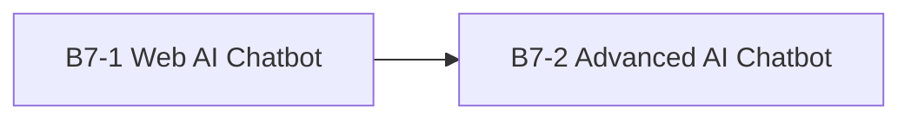
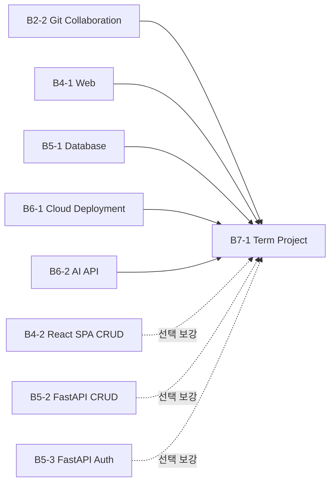
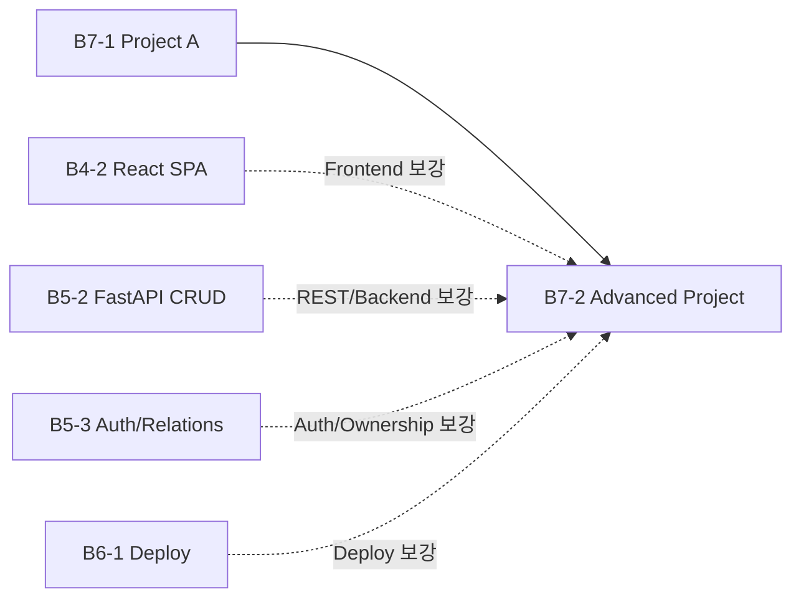

# R01 — Mission Dependency Map

동결일: 2026-08-17

## 목적

15개 미션의 선행 관계를 다음 3가지로 분리합니다.

1. **필수 선행 미션 (Required Prerequisite)** — 선행 결과물을 직접 사용하거나 공식 미션이 이전 프로젝트를 기반으로 요구함
2. **권장 선행 미션 (Recommended Prerequisite)** — 완료하지 않아도 시작 가능하지만 관련 개념을 미리 익혀 두면 수행이 쉬워짐
3. **있으면 좋은 선행 지식 (Recommended Prior Knowledge)** — 특정 미션 완료 여부와 무관하게 알고 있으면 좋은 개념

핵심 원칙은 **미션 완료를 불필요하게 Gate로 만들지 않는 것**입니다.

---

## 1. 필수 선행 미션



### B7-1 → B7-2

B7-2 공식 Mission은 "Project A에서 만든 AI 챗봇 MVP를 풀스택 웹 애플리케이션으로 고도화"하고, 기능 요구사항에서도 "Project A의 챗봇 기능을 기반으로" 확장하도록 요구합니다.

따라서 현재 과정에서 **B7-1 → B7-2만 필수 선행**으로 둡니다.

### B1-1 → B1-2는 왜 필수에서 제외하는가

B1-2는 `monitor.sh`, 프로세스, 포트, 로그, 자원 관제 개념을 사용하므로 B1-1을 먼저 학습하면 유리합니다. 그러나 B1-2 공식 Mission은 B1-1 미션 자체의 CLEAR 결과물을 필수 제출물이나 직접 입력으로 요구하지 않습니다.

따라서 B1-1은 B1-2의 **권장 선행 미션**으로 재분류합니다.

---

## 2. 권장 선행 미션

> 아래 관계는 **교육 설계상 권장**이며 공식 Hard prerequisite가 아닙니다. 해당 미션을 CLEAR하지 않았더라도 관련 지식을 이미 알고 있다면 후속 미션을 시작할 수 있습니다.

| 미션 | 권장 선행 미션 | 권장 이유 |
|---|---|---|
| B1-1 | - | 과정의 Linux 운영 기초 시작점 |
| B1-2 | **B1-1** | 프로세스·포트·로그·관제 사고방식 재사용 |
| B2-1 | - | Python 응용의 시작점 |
| B2-2 | B2-1 | 개인 구현 경험 후 Git 협업으로 확장하기 쉬움 |
| B3-1 | B2-1 | Python 구현 경험이 자료구조 구현에 도움 |
| B3-2 | B3-1, B2-2 | 자료구조/정렬 + Git commit/branch/history 개념을 함께 활용 |
| B4-1 | - | 웹 기초 시작점 |
| B4-2 | **B4-1** | HTML/CSS/JS 기초 후 React SPA/Remote CRUD로 확장 |
| B5-1 | - | DB/SQL 기초 시작점 |
| B5-2 | **B5-1**, B4-1 | SQL/DB와 HTML form/Web 흐름을 FastAPI CRUD에서 결합 |
| B5-3 | **B5-2**, B5-1 | CRUD 구조 위에 인증·관계·세션 개념 추가 |
| B6-1 | B4-1 | 실제 웹 결과물을 배포 대상으로 사용하면 이해가 쉬움 |
| B6-2 | B2-2 | Git diff/commit/branch 개념이 AI 코드 설명 도구 이해에 도움 |
| B7-1 | **B2-2, B4-1, B5-1, B6-1, B6-2** | Git 협업·Web·DB·Deploy·AI API가 Term Project에서 통합됨 |
| B7-2 | B4-2, B5-2, B5-3, B6-1 | Frontend SPA, REST/CRUD, Auth/Ownership, Deploy 경험이 고도화에 도움 |

---

## 3. 있으면 좋은 선행 지식

> 아래는 미션 완료 여부와 무관합니다. 모르면 현재 미션 안에서 학습해도 되며, 알고 있으면 시행착오를 줄일 수 있습니다.

| 미션 | 있으면 좋은 선행 지식 |
|---|---|
| B1-1 | Linux CLI, 파일/디렉터리, 사용자·권한, 프로세스 기초 |
| B1-2 | 프로세스/PID, TCP Port, 로그, CPU·Memory 지표, OOM·Deadlock 기초 |
| B2-1 | Python 문법, 함수, 클래스, 파일 입출력, CLI 기초 |
| B2-2 | Git `add/commit/branch/merge/remote`, GitHub Issue/PR 기초 |
| B3-1 | Python OOP, 자료구조, 시간복잡도(Big-O) 기초 |
| B3-2 | Git commit/branch/history, Graph/DAG, 정렬 알고리즘 기초 |
| B4-1 | HTML, CSS, JavaScript, Browser/DOM, Git/GitHub 기초 |
| B4-2 | DOM Event, `fetch`, 비동기 처리, SPA 개념, React 기초 |
| B5-1 | Table/Row/Column, Entity/Relationship, SQL 기본 문법 |
| B5-2 | HTTP Request/Response, Form, CRUD, SQL, Python Web 기초 |
| B5-3 | Session, Authentication/Authorization, 관계형 DB, CRUD |
| B6-1 | Linux, TCP/IP, HTTP, Nginx/Web Server, Cloud Network 기초 |
| B6-2 | Git diff/commit, HTTP API, JSON, 환경변수/API Key 개념 |
| B7-1 | Git 협업, Frontend/Backend, DB, 배포, AI API의 기본 흐름 |
| B7-2 | REST, Auth/Ownership, 관계형 모델, Cloud Deploy, 기술 문서화 |

---

## 4. B7-1에 수렴하는 학습 전이



이 구조의 의미는 **필수 미션을 모두 끝내야만 B7-1을 시작할 수 있다는 뜻이 아닙니다.**

B7-1을 수행할 수 있을 만큼 각 영역의 핵심 지식이 준비되었다면 시작할 수 있고, 부족한 부분만 해당 선행 미션 또는 개념 학습으로 보충할 수 있습니다.

---

## 5. B7-2 고도화 경로



B7-1만 필수 선행입니다. 나머지는 B7-2에서 필요한 세부 역량을 강화하는 선택적 준비 경로입니다.

---

## 6. Phase C 기본 실행 순서

```text
B1-1
→ B1-2
→ B2-1
→ B2-2
→ B3-1
→ B3-2
→ B4-1
→ B5-1
→ B6-1
→ B6-2
→ B7-1
→ B4-2
→ B5-2
→ B5-3
→ B7-2
```

이 순서는 **R01 운영 순서**이지 모든 인접 미션 사이의 필수 의존성을 뜻하지 않습니다.

예를 들어 B1-1 → B1-2는 R01에서 순차 진행하지만, Dependency 분류상 B1-1은 B1-2의 권장 선행입니다.

---

## 7. 환경 재사용과 금지사항

재사용하는 것은 **개념과 운영 규칙**입니다.

```text
Git 협업 규칙
Python 3.10+ baseline
AI_API_* naming
Secret 금지 정책
Evidence 사고방식
한 번에 한 Runtime
```

재사용하지 않는 것은 **상태가 섞일 수 있는 Runtime 자원**입니다.

```text
미션 간 .venv 공유 금지
SQLite DB 공유 금지
B4-2 Supabase project/table 공유 금지
B1-1/B1-2 Agent runtime 자산 혼합 금지
B6-1 AWS shared/production resource cleanup 금지
B7-1/B7-2 auth token/DB/runtime 혼합 금지
```

---

## 8. Dependency 판단 규칙

### 필수 선행으로 올리는 조건

다음 중 하나가 명확해야 합니다.

1. 공식 Mission이 이전 프로젝트 또는 산출물을 직접 요구함
2. 후속 미션이 이전 결과물을 실제 입력/확장 대상으로 사용함
3. 이전 결과물이 없으면 후속 미션 요구사항 자체를 충족할 수 없음

### 권장 선행으로 두는 조건

다음 중 하나에 해당하면 권장 선행으로 둡니다.

1. 같은 기술 계열의 기초 → 응용 관계
2. 후속 미션의 핵심 개념을 이전 미션에서 먼저 연습함
3. 완료하지 않아도 대체 지식이 있으면 바로 시작 가능함

단순히 번호가 앞이라는 이유만으로 선행 관계를 만들지 않습니다.

---

## 최종 판정

- 필수 선행 연결: **1개 — B7-1 → B7-2**
- B1-1 → B1-2: **권장 선행으로 재분류**
- 선택 미션이 필수 과정의 Hard blocker가 되는 경우: **0**
- R01 실행 순서와 Dependency 분류: **서로 분리하여 관리**
