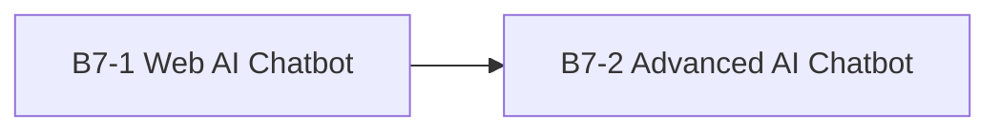
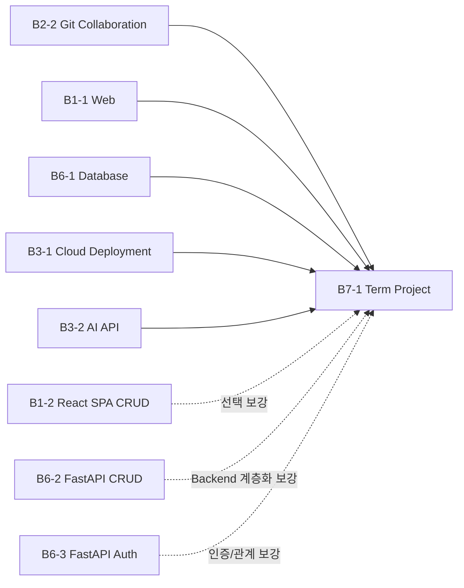

# R01 — 미션 선후관계 지도(Mission Dependency Map)

동결일: 2026-08-17  
현재 번호 재매핑: 2026-09-03

## 목적

15개 미션의 선행 관계를 다음 3가지로 분리합니다.

1. **필수 선행 미션(Required Prerequisite)** — 선행 결과물을 직접 사용하거나 공식 미션이 이전 프로젝트를 기반으로 요구함
2. **권장 선행 미션(Recommended Prerequisite)** — 완료하지 않아도 시작 가능하지만 관련 개념을 미리 익혀 두면 수행이 쉬움
3. **있으면 좋은 선행 지식(Recommended Prior Knowledge)** — 특정 미션 완료 여부와 무관하게 알고 있으면 좋은 개념

> 현재 Mission ID의 단일 기준은 [`CURRENT-MISSION-MAP.md`](../../CURRENT-MISSION-MAP.md)입니다. 이 문서는 기존 **주제 기준 Dependency(선후관계)**를 현재 Mission ID로 재매핑합니다.

핵심 원칙은 **미션 완료를 불필요하게 판정 조건(Gate)으로 만들지 않는 것**입니다.

## 한눈에 보기(Quick Read)

```text
필수 선행(Hard prerequisite)
B7-1 → B7-2  단 1개

R01 FAST TRACK 실행 순서(주제 기준 유지, 현재 ID 사용)
B4-1 → B4-2 → B2-1 → B2-2 → B5-1 → B5-2
→ B1-1 → B6-1 → B3-1 → B3-2 → B7-1
→ B1-2 → B6-2 → B6-3 → B7-2

중요
실행 순서 ≠ 모든 미션 사이의 필수 의존성
```

현재 어떤 미션을 실행해야 하는지는 [NEXT-ACTIONS.md](NEXT-ACTIONS.md), 전체 색인은 [`../../MISSION-INDEX.md`](../../MISSION-INDEX.md)를 확인합니다.

---

## 1. 필수 선행 미션



### B7-1 → B7-2

B7-2는 Project A에서 만든 AI 챗봇 MVP를 풀스택 웹 애플리케이션으로 고도화하는 프로젝트이므로 **B7-1 결과물을 실제 기반으로 사용**합니다.

따라서 현재 과정에서 **B7-1 → B7-2만 필수 선행**으로 둡니다.

### B4-1 → B4-2는 왜 필수가 아닌가

현재 B4-2 시스템 장애 분석은 B4-1 시스템 관제의 프로세스·포트·로그·관제 사고방식을 활용하면 유리합니다. 그러나 B4-1의 CLEAR 결과물 자체를 필수 제출물이나 직접 입력으로 요구하는 관계는 아니므로 **권장 선행**으로 둡니다.

---

## 2. 권장 선행 미션

> 아래 관계는 교육 설계상 권장입니다. 공식 필수 선행(Hard Prerequisite)이 아닙니다.

| 현재 미션 | 권장 선행 미션 | 권장 이유 |
|---|---|---|
| **B1-1** 웹 포트폴리오 | - | 웹 기초 시작점 |
| **B1-2** React SPA | **B1-1** | HTML/CSS/JS와 DOM 흐름 후 React 상태·라우팅으로 확장 |
| **B2-1** 가계부 | - | Python 응용 시작점 |
| **B2-2** Git 팀 협업 | B2-1 | 개인 구현 경험 후 Git 협업으로 확장하기 쉬움 |
| **B3-1** 클라우드 인프라 | B1-1 | 실제 웹 결과물을 배포 대상으로 사용하면 이해가 쉬움 |
| **B3-2** AI Git 도우미 | B2-2 | Git diff/commit/branch 개념이 AI 자동화 이해에 도움 |
| **B4-1** 시스템 관제 | - | Linux 운영 기초 시작점 |
| **B4-2** 시스템 장애 분석 | **B4-1** | 프로세스·포트·로그·관제 사고방식 재사용 |
| **B5-1** Mini Redis | B2-1 | Python 구현 경험이 자료구조 구현에 도움 |
| **B5-2** Mini Git | **B5-1**, B2-2 | 자료구조/탐색·정렬 + Git commit/branch/history 개념 활용 |
| **B6-1** SQL 데이터베이스 | - | DB/SQL 기초 시작점 |
| **B6-2** FastAPI CRUD | **B6-1**, B1-1 | SQL/DB와 HTML form/Web 흐름을 FastAPI CRUD에서 결합 |
| **B6-3** FastAPI 인증·연관관계 | **B6-2**, B6-1 | CRUD 구조 위에 인증·인가·관계·세션 개념 추가 |
| **B7-1** AI 챗봇 | **B2-2, B1-1, B6-1, B3-1, B3-2** | Git 협업·Web·DB·Deploy·AI API를 Term Project에서 통합 |
| **B7-2** AI 챗봇 고도화 | B1-2, B6-2, B6-3, B3-1 | SPA, REST/CRUD, Auth/Ownership, Deploy 경험이 고도화에 도움 |

---

## 3. 있으면 좋은 선행 지식

| 현재 미션 | 있으면 좋은 선행 지식 |
|---|---|
| B1-1 | HTML, CSS, JavaScript, Browser/DOM, Git/GitHub 기초 |
| B1-2 | DOM Event, `fetch`, 비동기 처리, SPA, React 기초 |
| B2-1 | Python 문법, 함수, 클래스, 파일 입출력, CLI 기초 |
| B2-2 | Git `add/commit/branch/merge/remote`, GitHub Issue/PR 기초 |
| B3-1 | Linux, TCP/IP, HTTP, Nginx/Web Server, Cloud Network 기초 |
| B3-2 | Git diff/commit, HTTP API, JSON, 환경변수/API Key 개념 |
| B4-1 | Linux CLI, 파일/디렉터리, 사용자·권한, 프로세스 기초 |
| B4-2 | 프로세스/PID, TCP Port, 로그, CPU·Memory, OOM·Deadlock 기초 |
| B5-1 | Python OOP, 자료구조, 시간복잡도(Big-O) 기초 |
| B5-2 | Git commit/branch/history, Graph/DAG, 정렬 알고리즘 기초 |
| B6-1 | Table/Row/Column, Entity/Relationship, SQL 기본 문법 |
| B6-2 | HTTP Request/Response, Form, CRUD, SQL, Python Web 기초 |
| B6-3 | Session, Authentication/Authorization, 관계형 DB, CRUD |
| B7-1 | Git 협업, Frontend/Backend, DB, 배포, AI API의 기본 흐름 |
| B7-2 | REST, Auth/Ownership, 관계형 모델, Cloud Deploy, 기술 문서화 |

---

## 4. B7-1에 수렴하는 학습 전이



이 구조는 **필수 미션을 모두 끝내야만 B7-1을 시작할 수 있다는 뜻이 아닙니다.** B7-1 수행에 필요한 핵심 지식이 준비되었는지를 판단하는 학습 전이 지도입니다.

---

## 5. B7-2 고도화 경로


B7-1만 필수 선행입니다. 나머지는 B7-2에서 필요한 세부 역량을 강화하는 선택적 준비 경로입니다.

---

## 6. 시작 전 지식 체크 운영

선행 관계가 실제 학습에 사용되도록 관련 Mission Repository의 `training/round-01-clear/START-CHECK.md`에서 **미션 완료 여부가 아니라 현재 보유 지식**을 먼저 확인합니다.

권장 적용 미션:

```text
B1-2
B2-2
B3-1
B3-2
B4-2
B5-1
B5-2
B6-2
B6-3
B7-1
B7-2
```

운영 흐름:

```text
시작 점검(START-CHECK)
→ 필수 선행 존재 여부 확인
→ 권장 선행/선행 지식 자가진단
→ 부족한 개념만 선택 보충
→ 입문자 가이드(BEGINNER-GUIDE)
→ 실제 실행(Runtime)
→ 검증(Verification)
→ 증빙(Evidence)
```

판정 원칙:

- `START-CHECK.md`는 공식 시험이나 합격 점수표가 아닙니다.
- 필수 선행이 없는 미션은 권장 선행 미션을 CLEAR하지 않았더라도 필요한 개념을 알고 있으면 시작할 수 있습니다.
- 일부 개념이 부족하면 권장 미션 전체를 다시 하기보다 필요한 Step/개념만 보충할 수 있습니다.
- B7-2는 B7-1 결과물을 실제 기반으로 요구하므로 B7-1 준비 여부를 필수로 확인합니다.

---

## 7. Phase C 기본 실행 순서

```text
Stage 1 — Required
B4-1 → B4-2 → B2-1 → B2-2 → B5-1 → B5-2
→ B1-1 → B6-1 → B3-1 → B3-2 → B7-1

Stage 2 — Optional
B1-2 → B6-2 → B6-3 → B7-2
```

이 순서는 **R01 운영 순서**이지 모든 인접 미션 사이의 필수 의존성을 뜻하지 않습니다.

---

## 8. 환경 재사용과 금지사항

재사용하는 것은 **개념과 운영 규칙**입니다.

```text
Git 협업 규칙
Python baseline
AI_API_* naming
Secret 금지 정책
Evidence 사고방식
한 번에 한 Runtime
```

재사용하지 않는 것은 상태가 섞일 수 있는 Runtime 자원입니다.

```text
미션 간 .venv 공유 금지
SQLite DB 공유 금지
B1-2 Supabase project/table 공유 금지
B4-1/B4-2 Agent runtime 자산 혼합 금지
B3-1 AWS shared/production resource cleanup 금지
B7-1/B7-2 auth token/DB/runtime 혼합 금지
```

---

## 9. 선후관계(Dependency) 판단 규칙

### 필수 선행으로 올리는 조건

다음 중 하나가 명확해야 합니다.

1. 공식 Mission이 이전 프로젝트 또는 산출물을 직접 요구함
2. 후속 미션이 이전 결과물을 실제 입력/확장 대상으로 사용함
3. 이전 결과물이 없으면 후속 미션 요구사항 자체를 충족할 수 없음

### 권장 선행으로 두는 조건

다음 중 하나에 해당하면 권장 선행으로 둡니다.

1. 개념 재사용으로 학습 난도가 낮아짐
2. 같은 기술 흐름을 단계적으로 확장함
3. 실수·환경 오류를 줄이는 데 도움이 됨

권장 선행은 `CLEAR Gate`가 아닙니다.

---

## 최종 판정

```text
필수 선행(Hard prerequisite): B7-1 → B7-2 단 1개
권장 선행: 교육 설계상 다수 존재
FAST TRACK 순서: 주제 기준으로 유지하고 현재 Mission ID로 재매핑
Repository: 주제 기반 Canonical Repository 유지
Mission ID 변경: 수행 이력 초기화 없음
```
